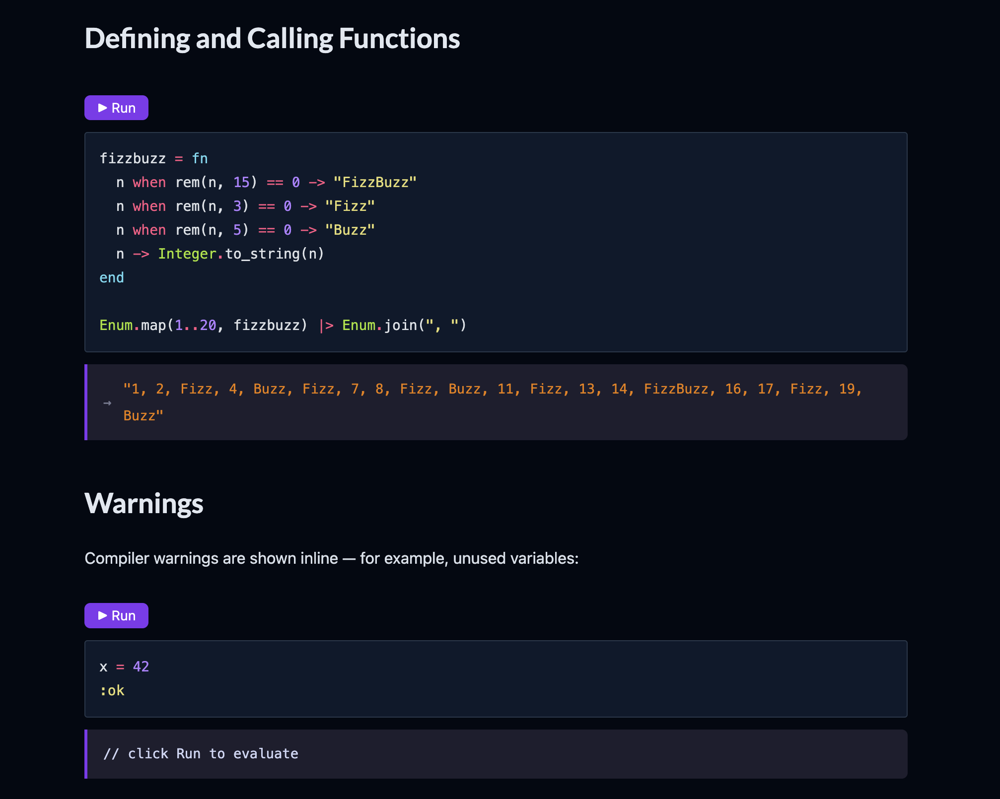

# PopcornExDoc

An [ExDoc](https://github.com/elixir-lang/ex_doc) extension that adds interactive, runnable Elixir code blocks to your generated documentation — powered by [Popcorn](https://github.com/software-mansion/popcorn).

Readers can click **Run** directly in the docs and see live output, without leaving the page.

---

## How it works

- Your docs are generated normally with ExDoc.
- PopcornExDoc injects a small JS bundle and CSS into the HTML output.
- Code blocks marked with the `popcorn-eval` class get a **Run** button and an output area.
- Clicking **Run** executes the code via an [AtomVM](https://www.atomvm.net/) WASM runtime embedded in the page — no server required.

**Stack:**

- Elixir + [Popcorn](https://github.com/software-mansion/popcorn) (WASM runtime bridge)
- AtomVM (runs compiled Elixir in the browser via WASM)
- esbuild (JS bundler)
- ExDoc hooks (`before_closing_head_tag` / `before_closing_body_tag`)

---

## Installation

Add to your `mix.exs`:

```elixir
def deps do
  [
    {:popcorn_exdoc, "~> 0.1.0"}
  ]
end
```

---

## Usage

### 1. Configure ExDoc

Pipe your ExDoc options into `PopcornExDoc.config/1`:

```elixir
defp docs do
  [
    main: "MyApp",
    extras: [
      "guides/introduction.md",
      "guides/examples.md"
    ]
  ]
  |> PopcornExDoc.config()
end
```

`PopcornExDoc.config/1` merges the required assets and hooks into your options. If you already use `before_closing_head_tag` or `before_closing_body_tag` for another extension, the functions are composed — both run.

### 2. Mark code blocks as runnable

In your module docs or guides, add the `popcorn-eval` class to a fenced code block using ExDoc's IAL syntax:

````markdown
```elixir
IO.puts("Hello from WASM!")
1 + 1
```
{: .popcorn-eval}
````

ExDoc will render this as an interactive block with a **Run** button. Clicking it evaluates the code in the browser and shows stdout, return value, and any errors inline.

### Example



---

## Project structure

```
lib/
  popcorn_exdoc.ex              # ExDoc config hooks (injects CSS + JS)
  mix/tasks/popcorn_exdoc.build.ex  # `mix popcorn_exdoc.build` task

wasm/
  lib/eval_elixir.ex            # WASM-side GenServer, handles eval calls
  lib/eval_elixir/evaluator.ex  # Runs Code.eval_string/3 with isolated bindings

client/
  popcorn_exdoc.js              # JS entry point
  src/runtime.js                # Initializes the Popcorn WASM instance
  src/blocks.js                 # Decorates <pre.popcorn-eval> with Run buttons
  src/render.js                 # Renders stdout / return values / errors
  build.mjs                     # esbuild config

priv/static/                    # Built assets (committed, not generated at install time)
  popcorn_exdoc.js
  popcorn_exdoc.css
  bundle.avm                    # Compiled Elixir WASM bundle
  AtomVM.{mjs,wasm}
```

---

## Building assets (maintainers only)

Requires Node.js.

```bash
mix popcorn_exdoc.build
```

This compiles the Elixir WASM bundle, bundles the JS via esbuild, and copies everything to `priv/static/`. End users do **not** need to run this — built assets are included in the package.
